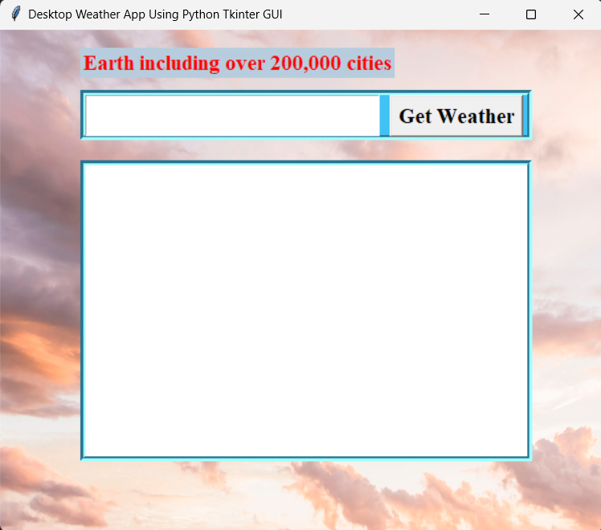
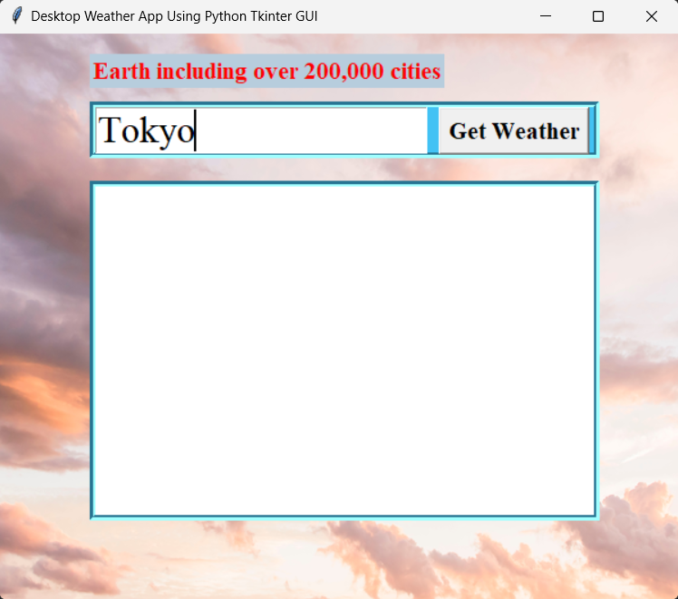
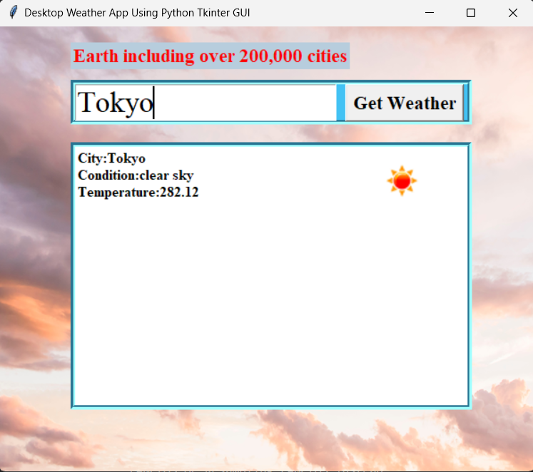
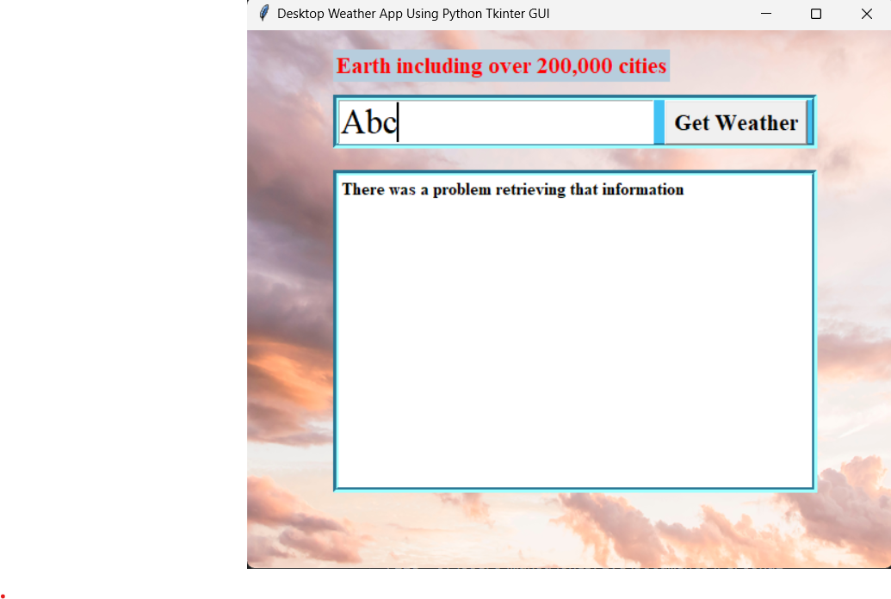

# ☁️🌞Desktop Weather Application

Welcome to TINT's Weather App! This project is a testament to my journey into the world of web scraping and Python GUI development, initiated during my first year of learning. With this simple yet effective application, users can check the current weather conditions for over 200,000 cities worldwide.

# 🧐Table of Contents

- **[Features]**

- **[Prerequisites]**

- **[Installation]**

- **[Screenshots]**

- **[Support]**
  
## 🚀 Features
- **City Input**: Enter the name of any city to retrieve its current weather data.
- **Weather Display**: View detailed information such as the city name, weather condition, and temperature.
- **Weather Icon**: Visualize the weather condition with an accompanying icon for better understanding.

## 💻 Technologies
- **Python**: The core language used for the application logic.
- **Tkinter**: Python's standard GUI toolkit for creating graphical user interfaces.
- **OpenWeatherMap API**: A free weather data API used to fetch real-time weather information.
- **PIL (Python Imaging Library)**: A library used for opening, manipulating, and saving many different image file formats.

## 💡 Prerequisites
- Python 3.x
- Tkinter Library
- Requests Library
- PIL Library

## 🙌 Installation
1. Clone the repository:
   ```bash
   git clone https://github.com/your_username/your_repository.git

2.  Install the required libraries:
    ```bash
    pip install -r requirements.txt

## Usage
1.  Run the application:

    ```bash
    python weather_app.py
   
2.  Enter the desired city in the provided textbox.

3.  Click "Get Weather" to fetch and display the current weather information.

## 📷 Screenshots
<div>
   <h2 align="center"></h2>
   <h2 align="center"></h2>
   <h2 align="center"></h2>
   <h2 align="center"></h2>
</div>


## 😀 Support
If you encounter any issues or have suggestions for improvement, please feel free to open an issue in the issue tracker. Your feedback is valuable to me!

<div align="center">
  
### Show some ❤️ by starring some of the repositories!

</div>
